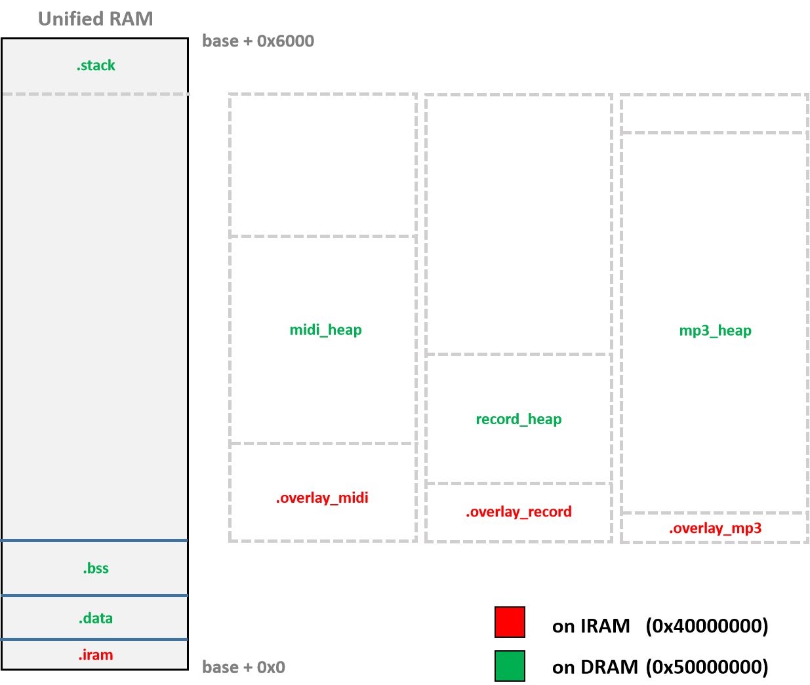

Memory Map
======================

SRAM
----------------------

KIWI SoC的SRAM具有以下特性：

  - 24KB
  - 1 Block
  - 单周期访问性能
  - 具有2组线性地址空间: ``0x40000000~0x40005fff`` 与 ``0x50000000~0x50005fff`` ，对应同一物理地址空间
  - 用户工程下，默认：

    + 将 ``0x40000000`` 起始的线性空间作为代码空间 ``IRAM Region`` 使用
    + 将 ``0x50000000`` 起始的线性空间作为数据空间 ``DRAM Region`` 使用

结合KIWI SRAM的特性，上图描述了用户工程下SRAM的静态段划分：

  - ``.iram`` 段位于代码空间，用于放置中断向量表和有必要运行于SRAM的函数，由用户程序完成初始化。
  - ``.data`` 段位于数据空间，用于存放程序中已初始化的全局变量，由用户程序完成初始化。
  - ``.bss`` 段位于数据空间，用于存放程序中未初始化的全局变量，由用户程序完成初始化。
  - ``.stack`` 段位于数据空间，作为栈，存放程序临时创建的局部变量，由编译器生成必要的栈操作代码。

``.bss`` 段与 ``.stack`` 段之间的SRAM区域(OVERLAYs)是KIWI各个预设场景工作时的占用空间，
每个场景下该区域一般被划分成场景特定的SRAM代码空间和数据空间，其中后者以堆(heap)的形式存在和使用。
在工作场景需要进行切换时，用户可以通过调用目标场景提供的init()函数完成对该区域的有效初始化。

NOR Flash
------------------

下面会对上述过程进行更为详细的阐述。
